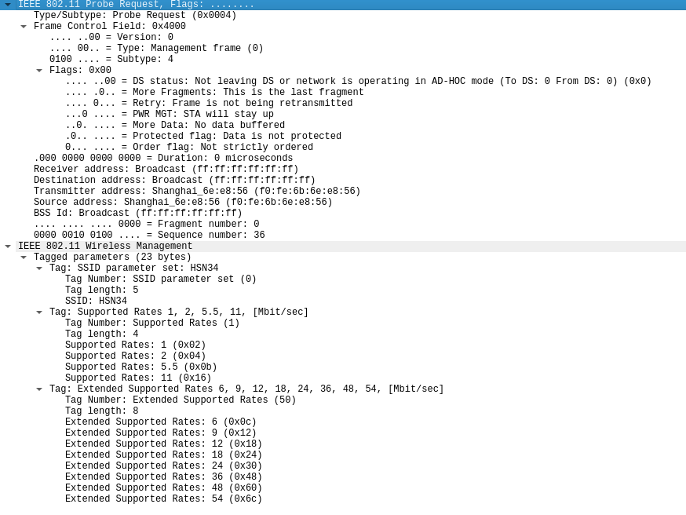

     

# Management Frame Doom

This project embeds infiltration and exfiltration data in valid WiFi managemement frames. This allows an attacker in proximity to an attacker-controlled client to have bi-directional communications in a method that would be nearly impossible for defenders to pick up on.

## Name

M.F. Doom is a fantastic artist you should listen to, I named this project in tribute to them.

# Theory

WiFi uses special packets called "management frames" to control the communications between clients and Access Points. Simply put, management frames are things like "Hey I want to join your network!" and "Hi, I'm broadcasting WiFi with this SSID on this channel", etc.

What if we could stuff extra attacker-defined data into these packets? No one would ever think to look in them, right?

## Management Frames

## Probe Frames

Probe frames are sent by clients (a.k.a. your phone or computer) to see what WiFis are in-range, and what protocols they support. Imagine walking into a room and yelling "WHO IS HERE, AND DO YOU SPEAK MY LANGUAGE?", that's a "probe request", essentially. In response, "probe response" packets are sent by APs that support your language.

## Probe Request

It's fairly handy that we can actually have the attacker poll and wait for a communication than the other way around. A lot of time, if your implant/malware needs to poll and wait for a message, it makes it much easier to find. Since Probe Requests initiate the communications, we can just start sending data out and assume the attacker receives it (or if we really want to, we can implement a SYN-SYN/ACK-ACK model).

Refering to the image above, we can start understanding some of the information:

**IEE 802.11 Probe Request:** This is the Probe Request Management frame basically saying "Hey this is a probe request"
1. Type/Subtype: This will always be 0x4 for a probe request
2. Frame Control Version: Version is always 0x00, Type is always 0x00, and Subtype is always 0x04
3. Flags: This will always be 0x00 for our purposes
4. Receiver Address: This will always be `ff:ff:ff:ff:ff:ff` for probe requests
5. Destination Address: This will always be `ff:ff:ff:ff:ff:ff` for probe requests
6. Transmitter Address: This needs to be our interface's MAC if we want to receive the request. We could set this to another address if we have the interface in monitor mode, however I want to see if this project works without root.
7. Source Address: This needs to be our interface's MAC if we want to receive the request. We could set this to another address if we have the interface in monitor mode, however I want to see if this project works without root.
8. BSS Id: This will always be `ff:ff:ff:ff:ff:ff` for probe requests

**IEEE 802.11 Wireless Management:** This is where the information we want to stuff will go. This information is all decided by the client and even supports "extended" information. This handy image from MRN-CCIEW explains this section:

So looking through the various Tags we can send over in a Probe Request, I'm looking for something pretty innocuous that would allow stuff more data, and I ended up with Tag Number 0x45 "Time Advertisement"